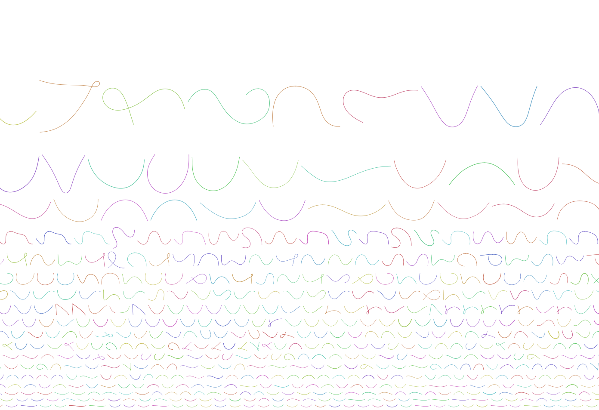

# Day3

log on to cau cluster
ssh -X sunam235@caucluster-old.rz.uni-kiel.de

- create day folder in /work_beegfs/sunam235

```
mkdir day3
```

- copy data for today 

```
 cp -r /home/sunam226/Day3/* /work_beegfs/sunam235/day3
 ```
- activate conda environment
```
conda activate /home/sunam226/.conda/envs/anvio
```

 - see how many contigs in file
  ```
 grep -c ">" final.contigs.fa
 ```

 - transform fasta into format for program "bandage"
```
 megahit_toolkit contig2fastg 99 final.contigs.fa > final.contigs.fastg                   
```

- copy fastg file to desktop 
- open new terminal go to /Desktop/Bandage
- to open Bandage: 
  ```
   ./Bandage
   ```
- save image

#  Question:  
- Please submit your generated figure and explain in your own words what you can see (keep it short).
  
  -
- create sBatch script for metaquast
  
 sbatch: 


- copy output because sbatch to long

cp -r /home/sunam226/Day3/3_metaquast_out/* /work_beegfs/sunam235/day3/3_metaquast

# Questions

    - What is your N50 value? Why is this value relevant?
            - N50 value: 2963
            - used to assess the contiguity of an assembly
    - How many contigs are assembled?
            - total number: 57414
    - What is the total length of the contigs?
            - total length: 
                       Total length (>= 0 bp)	145675865
                            Total length (>= 1000 bp)	145675865
                            Total length (>= 5000 bp)	54320345
                            Total length (>= 10000 bp)	35606379
                            Total length (>= 25000 bp)	15980254
                            Total length (>= 50000 bp)	8011272

# PreMapping
sbatch 

# mapping 
copy contigs.anvio.fa (cp contigs.anvio.fa ../4_mapping)

sbatch 


check if running
squeue -u sunam235

convert .sam files to .bam files
sbatch script: sbatch 

``
create contigs database
sbatch script:  

# Binning with anvio
not longer on front end on hpc, gives node number 010
```
srun --reservation=biol217 --pty --mem=10G --nodes=1 --tasks-per-node=1 --cpus-per-task=1 --partition=all /bin/bash
conda activate /home/sunam225/miniconda3/miniconda4.9.2/usr/etc/profile.d/conda.sh/envs/anvio-7.1

anvi-display-contigs-stats contigs.db
```
server adress http://0.0.0.0:8082

open new terminal
```
ssh -L 8060:localhost:8080 sunam235@caucluster-old.rz.uni-kiel.de
ssh -L 8080:localhost:8080 node010
```
open in Chrome:
```
http://127.0.0.1:8060
```

- Sort and index .bam files with anvio

  - sbatch script: 

- create anvio profile

  - sbatch script: 

- merge profiles
  - sbatch script: 

- Binning with
  - Metabat2
  - Concoct 

        cp /home/sunam226/Day3/5_anvio-profiles/SUMMARY*/*.html

# Questions
- Number of Archaea bins you got from MetaBAT2?
    - 3
- Number of Archaea bins you got from CONCOCT?
    - 2

- Number of Archaea bins you got after consolidating the bins?
    - 2


-

 anvi-estimate-genome-completeness -p merged_profiles/PROFILE.db -c /work/sunam226/Day3/5_anvio_profiles/contigs.db --list-collections


 anvi-interactive -p merged_profiles/PROFILE.db -c /home/sunam226/Day3/5_anvio_profiles/contigs.db -C METABAT

# how to save image


# Files
- fastq.gz files  (reads)
- cleaned up: fastq.gz
- assembly: fasta (contigs)
- mapping: assemble(fasta)+rawreads(cleanfastq)
- sam files mapping file formats
- bam files