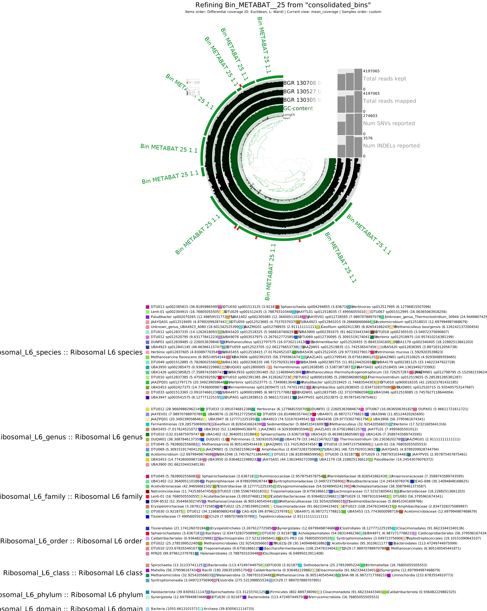

# Day 4 and 5

    cd /work_beegfs/sunam235/Day5

- Bin refinement
    - sbatch script: 

- Archaea bin refinement
  
         cd /work_beegfs/sunam235/Day5/5_anvio_profiles/summaryunrefined/bin_by_bin

        mkdir ../../ARCHAEA_BIN_REFINEMENT

        cp /work_beegfs/sunam235/Day5/5_anvio_profiles/summaryunrefined/bin_by_bin/Bin_Bin_1_sub/*.fa /work_beegfs/sunam235/Day5/5_anvio_profiles/ARCHAEA_BIN_REFINEMENT
 
   - 2.Archaea Bin: Bin_Bin_1_sub repeat above cp...

- detection of chimera and contamination GUNC
  - sbatch script: [script](scripts/chimeradetect.sh)

# Questions

- Do you get Archaea bins that are chimeric?
    - Bin MEGABAT_25 not chimeric
    - Bin_Bin_1 chimeric

- In your own words (2 sentences max), explain what is a chimeric bin.
    - bin is contaminated, MAG contains contigs of more than 1 genome
  

refine Archaeas bin :Bin_METABAT__25

 not longer on front end on hpc

        srun --reservation=biol217 --pty --mem=10G --nodes=1 --tasks-per-node=1 --cpus-per-task=1 --partition=all /bin/bash

.

        
        conda activate /home/sunam225/miniconda3/miniconda4.9.2/usr/etc/profile.d/conda.sh/envs/anvio-7.1
.

        anvi-refine -c /work_beegfs/sunam235/Day5/contigs.db -C consolidated_bins -p /work_beegfs/sunam235/Day5/5_anvio_profiles/merged_profiles/PROFILE.db --bin-id Bin_METABAT__25 
.

        ssh -L 8060:localhost:8080 sunam###@caucluster-old.rz.uni-kiel.de
        ssh -L 8080:localhost:8080 node###

- refined bin (Bin_METABAT__25)
      - 
      - 

# Questions

- Does the quality of your Archaea improve?
  - visually yes
  - -> run anvi-estimate again of refined bin and unrefined bin -> values :)
  
- how abundant are the archaea bins in the 3 samples? (relative abundance)
  - 
    Metabat: 1.76, 1.14, 0.58
    Concoct: 0.96, 0.00, 0.40

# Taxonomic assignment

sbatch script:  

before:R:5.26 C:97.3
after: R:1.3 C:73.68

# Questions
- Did you get a species assignment to the archaea bins previously identified?
    - yes, species name: Methanoculleus sp012797575
   
- Does the HIGH-QUALITY assignment of the bin need revision?
  - revision is always better 
:))
