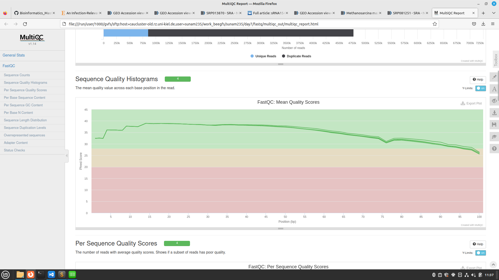

# Day 7

RNA seq and transcriptomics

    conda activate /home/sunam226/.conda/envs/grabseq

grab files, search in Paper for sra, ncbi,accession number
-> gives script for analysis

find SRRNumbers -> open SRA in relations-> runs
download files
sbatch : 

        grabseqs -t 4 -m metadata.csv SRR4018516
        grabseqs -t 4 -m metadata.csv SRR4018515
        grabseqs -t 4 -m metadata.csv SRR4018514
        grabseqs -t 4 -m metadata.csv SRR4018517	

-> not working--> faterq-dump

    fasterq-dump SRR4018514 SRR4018515 SRR4018516 SRR4018517

:))

download metadatafiles-> only 3 files

    grabseqs sra -l -t 4 -m metadata.csv SRP081251

Kröger et al. 2013

download metasv file -> 34 samples (dry run we are not downloading whole files)

    grabseqs sra -l -t 4 -m metadata.csv SRP028811

# Quality control

fastqc sbatch qualitycontol !

make all files into 1 -> makes new folder

    multiqc -d . -o multiqc_out

open html file

reads already cleaned, phredscore 25, 

if reads would need cleaning ->fastp

fastq files -> raw reads, or clean reads

important files for rna seq, fastq, fasta, gff

- Sequencing

    - depth < replicates

    - how many replicates -> >3

    - readlength 50bp for single end 100bp forpaired end, not over 300 bp

Example Analysis

activate reademption environment

    conda activate /home/sunam226/.conda/envs/reademption

check for needed softwares: 

    conda list
important softwares: deseq2; r-base; r-ggplot2; reademption

create projectpath, 
#own analysis : M. mazei

    reademption create --project_path READemption_analysis --species salmonella="Salmonella Typhimurium"

input files: reads:fastq ; refs:fasta ; annot:gff

prepare refs and annotations
assigning short name for long link

    FTP_SOURCE=ftp://ftp.ncbi.nih.gov/genomes/archive/old_refseq/Bacteria/Salmonella_enterica_serovar_Typhimurium_SL1344_uid86645/

download fasta sequences from NCBI

    wget -O READemption_analysis/input/salmonella_reference_sequences/NC_016810.fa $FTP_SOURCE/NC_016810.fna

    wget -O READemption_analysis/input/salmonella_reference_sequences/NC_017718.fa $FTP_SOURCE/NC_017718.fna

    wget -O READemption_analysis/input/salmonella_reference_sequences/NC_017719.fa $FTP_SOURCE/NC_017719.fna

    wget -O READemption_analysis/input/salmonella_reference_sequences/NC_017720.fa $FTP_SOURCE/NC_017720.fna

genome annotation file gff -> gene sequence fuction etc

    wget -P READemption_analysis/input/salmonella_annotations https://ftp.ncbi.nlm.nih.gov/genomes/all/GCF/000/210/855/GCF_000210855.2_ASM21085v2/GCF_000210855.2_ASM21085v2_genomic.gff.gz

unzip gz file

    gunzip READemption_analysis/input/salmonella_annotations/GCF_000210855.2_ASM21085v2_genomic.gff.gz

header of annotation and ref. sequence has to be the same for alignment
-> replacing header in all 4 files manually or:

    sed -i "s/>/>NC_016810.1 /" READemption_analysis/input/salmonella_reference_sequences/NC_016810.fa
    sed -i "s/>/>NC_017718.1 /" READemption_analysis/input/salmonella_reference_sequences/NC_017718.fa
    sed -i "s/>/>NC_017719.1 /" READemption_analysis/input/salmonella_reference_sequences/NC_017719.fa
    sed -i "s/>/>NC_017720.1 /" READemption_analysis/input/salmonella_reference_sequences/NC_017720.fa

download raw reads

    wget -P READemption_analysis/input/reads http://reademptiondata.imib-zinf.net/InSPI2_R1.fa.bz2
    wget -P READemption_analysis/input/reads http://reademptiondata.imib-zinf.net/InSPI2_R2.fa.bz2
    wget -P READemption_analysis/input/reads http://reademptiondata.imib-zinf.net/LSP_R1.fa.bz2
    wget -P READemption_analysis/input/reads http://reademptiondata.imib-zinf.net/LSP_R2.fa.bz2

run via .bash file

run whole script

# M. mazei paper project

create folder for project mkdir project + make reademption folders

    reademption create --project_path READemption_analysis --species Methanosarcina="Methanosarcina mazei"

download M. mazei Gö1 reference + annotations on ncbi (fasta+gff)
copy fasta+ gff+ raw reads 

        fasterq-dump SRR4018514 SRR4018515 SRR4018516 SRR4018517

 submit sbatch
 

