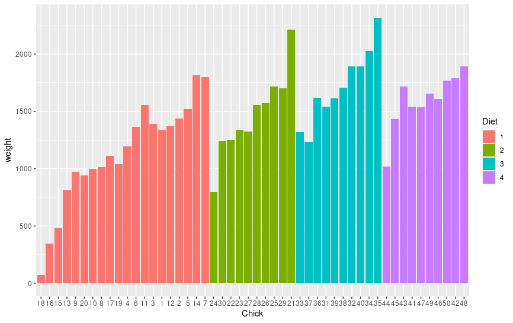
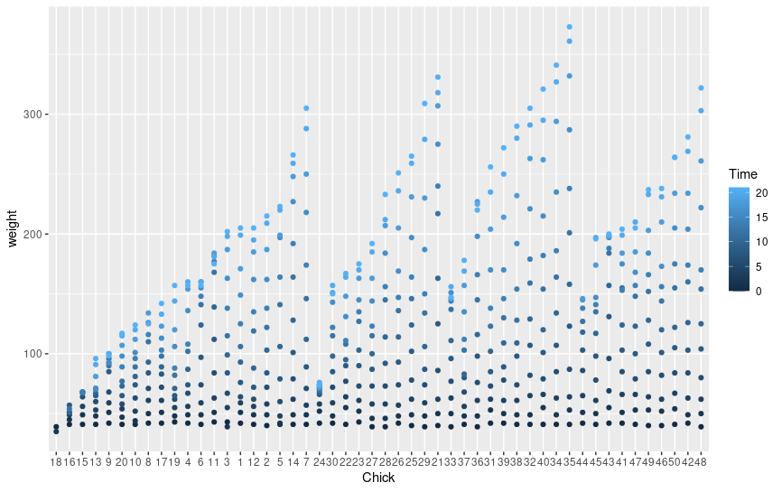
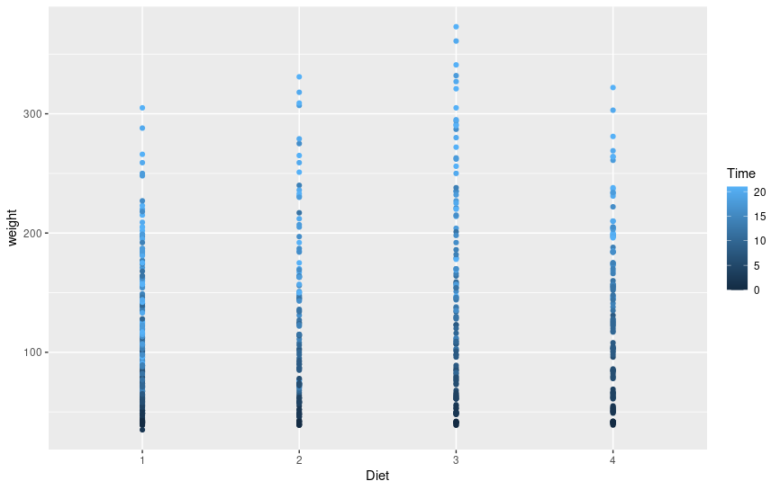
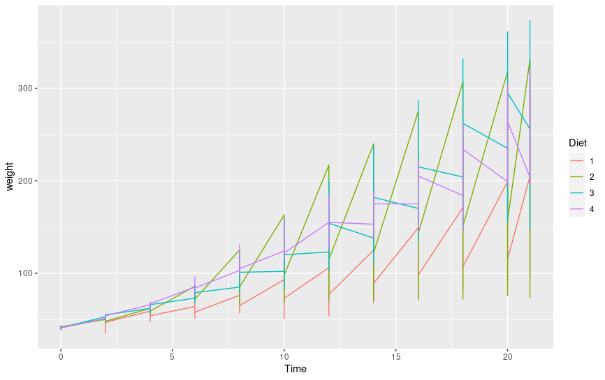
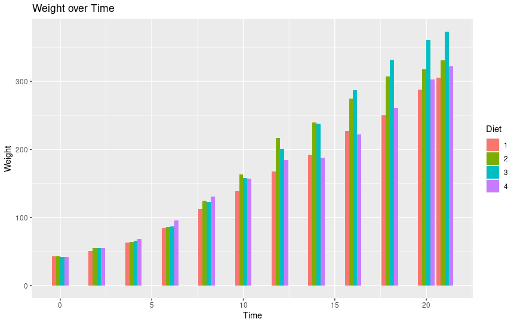

# Day 8 RNA-seq

redo redemption projectm.mazei

    conda activate /home/sunam226/.conda/envs/reademption

    reademption create --project_path READemption_analysis --species Methanosarcina='Methanosarcina_mazei'

download refs and annotations

    wget -O READemption_analysis/input/Methanosarcina_reference_sequences/GCF_000007065.1_ASM706v1_genomic.fna.gz https://ftp.ncbi.nlm.nih.gov/genomes/all/GCF/000/007/065/GCF_000007065.1_ASM706v1/GCF_000007065.1_ASM706v1_genomic.fna.gz

    gunzip READemption_analysis/input/Methanosarcina_reference_sequences/GCF_000007065.1_ASM706v1_genomic.fna.gz

    mv READemption_analysis/input/Methanosarcina_reference_sequences/GCF_000007065.1_ASM706v1_genomic.fna READemption_analysis/input/Methanosarcina_reference_sequences/GCF_000007065.1_ASM706v1_genomic.fa

    #download annotations
    wget -P READemption_analysis/input/Methanosarcina_annotations https://ftp.ncbi.nlm.nih.gov/genomes/all/GCF/000/007/065/GCF_000007065.1_ASM706v1/GCF_000007065.1_ASM706v1_genomic.gff.gz
    
    gunzip READemption_analysis/input/Methanosarcina_annotations/GCF_000007065.1_ASM706v1_genomic.gff.gz

    #modify header of the sequence file
    sed -i "s/>/>NC_003901.1 /" READemption_analysis/input/Methanosarcina_reference_sequences/GCF_000007065.1_ASM706v1_genomic.fa

copy raw reads

    cp /work_beegfs/sunam235/day7/mazeiproject/READemption_analysis/input/reads/*.fastq ./READemption_analysis/input/reads

install reademption->

conda install -c bioconda bioconductor-deseq2 -y
conda install -c bioconda segemehl -y
conda install -c r r-gplots -y

# R

Script:)

5 more or less nice plots about Chickens:)

