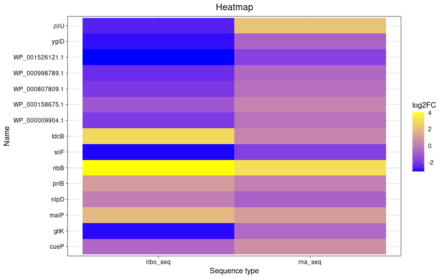
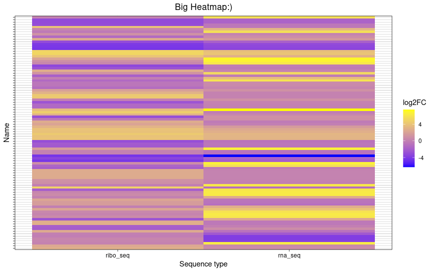

# Day 9

Questions:
- start codon: rev:TAC ->ATG
- stop: TAA
- length in AA: 186/3 ->61 -> STOP not AA
- SD(consensus AGGAGG at -7 to-4): Shine Dalgarno sequence start at -7
- name of upstream gene:alaS, STM14_RS15170
- csrA translated?-> yes because its protein coding
translated in WT coverage in RNA start before gene and ends after-> transcribed
in Ribo seq, when coverage starts at start of gene, ends at end of gene-> translated

Creating a Heatmap in R
script: 
heatmaps: 

small heatmap 
big heatmap 